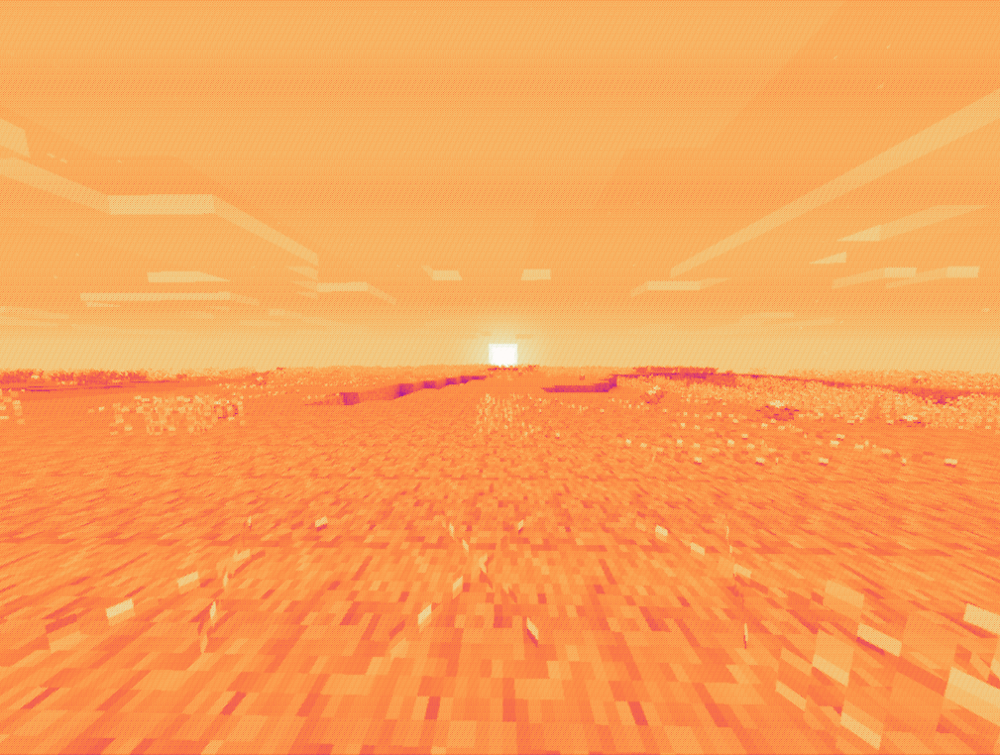
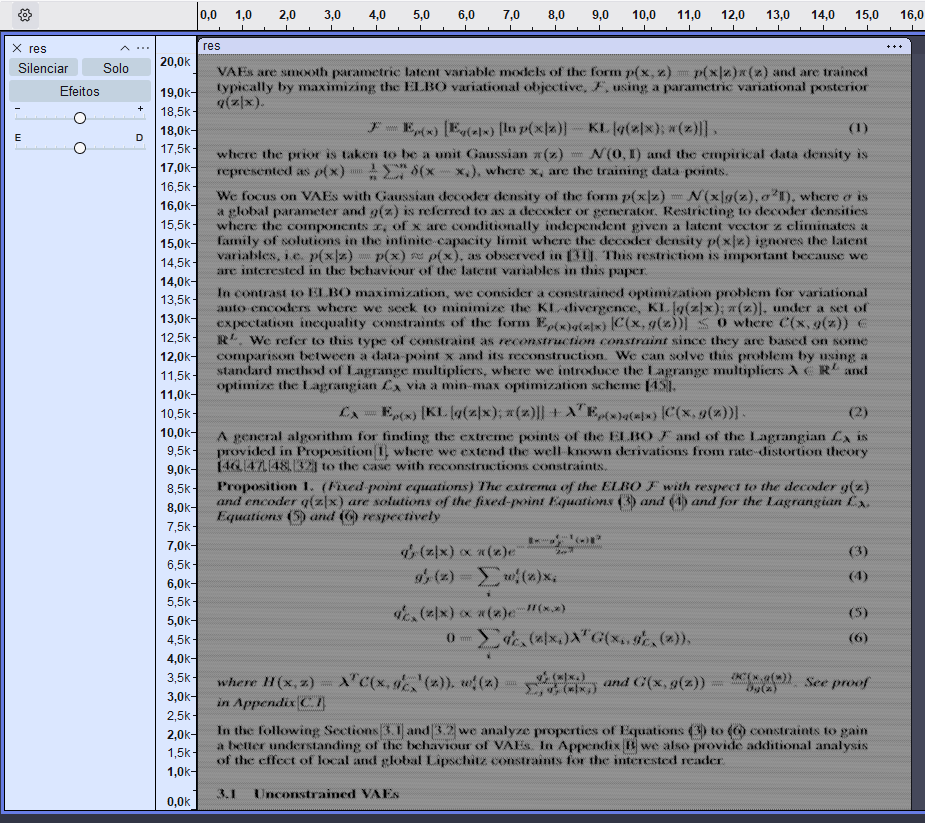
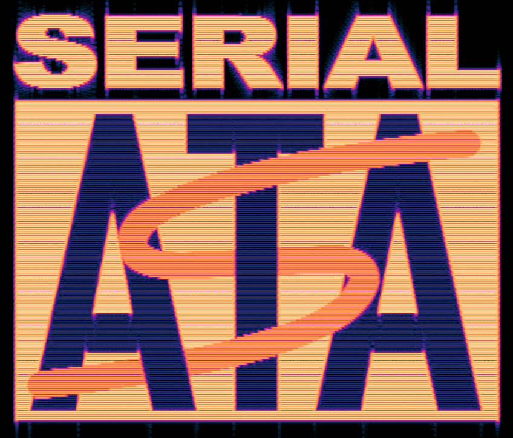
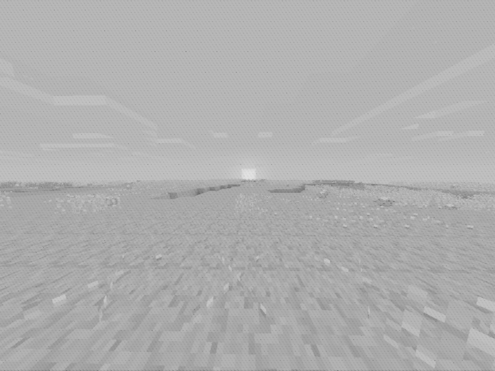
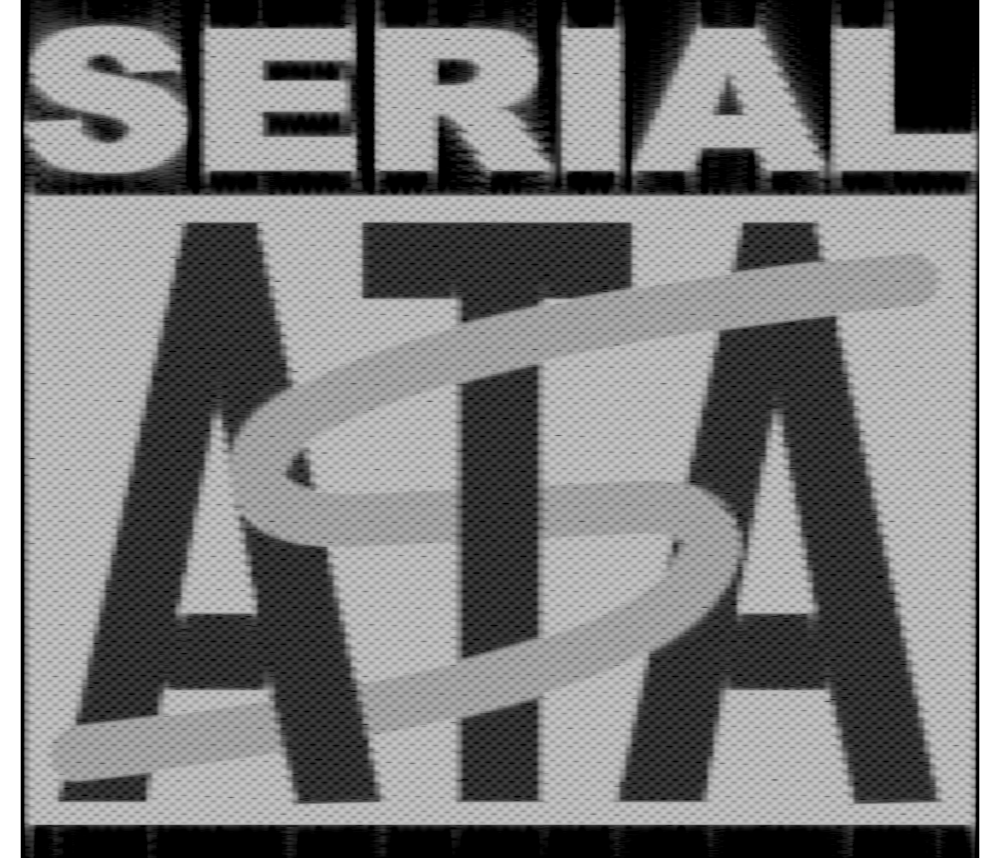
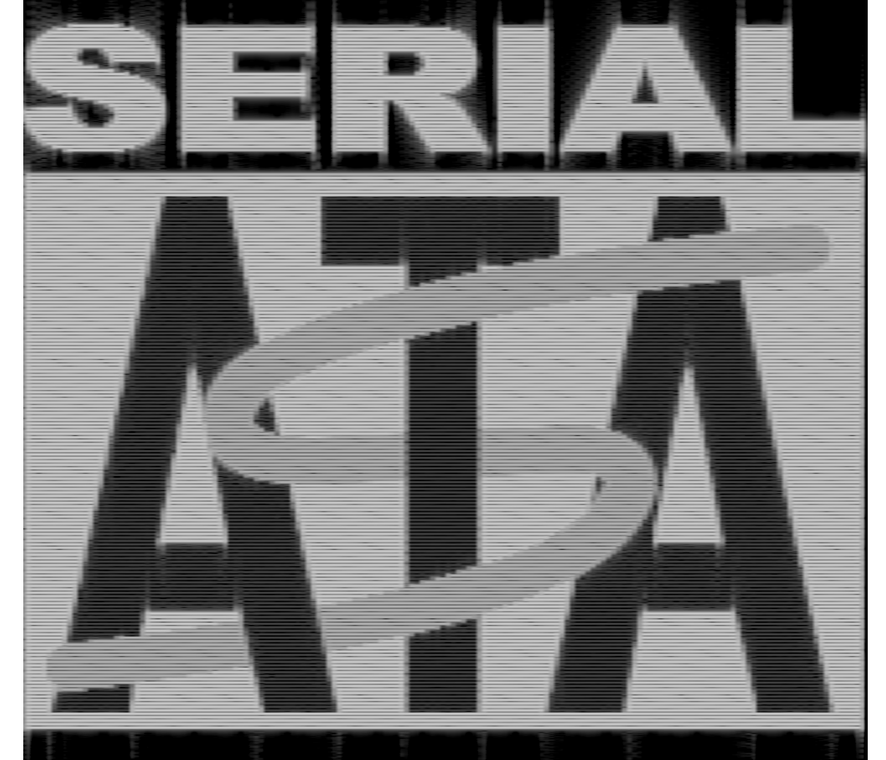

  

# ImageToSpectrogram

A script that transforms images into audio.

## Table of contents

* [Usage](#usage)
  * [`i2s.py`](#i2spy)
    * [About](#about)
    * [Concepts](#concepts)
    * [Arguments](#arguments)
      * [`--input`/`-i`](#--input-i)
      * [`--output`/`-o`](#--output-o)
      * [`--freq-min` & `--freq-max`](#--freq-min----freq-max)
      * [`--duration`/`-d`](#--duration-d)
      * [`--sample-rate`/`-r`](#--sample-rate-r)
      * [`--step-y`](#--step-y)
      * [`--offsets`](#--offsets)
* [Results](#results)

# Usage

## `i2s.py`:

## About

The `i2s.py` utility transforms images into audio files with a close approximation of your desired spectrograms.

## Concepts

The way that `i2s.py` works is quite simple, first the desired image is loaded as RGB and transformed into a `numpy` array, for every pixel the following function is applied:
$f\left(p\right)\ =\ \frac{\sum_{n=1}^{3}p\left[n\right]}{255\cdot3}^{2}$ and min-max normalization is applied in the resulting array, this results in a 2D array with all pixel values.  
With the resulting array from the previous operation every row is then iterated, upsampled using linear interpolation, and used as the multiplier for the current tone.  

TL;DR: Basically treat every linearly upsampled row of the image as a amplitude multiplier for the current tone.  
For more information on how each tone is created please read [`i2s.py` starting at line 122](i2s.py#L122).

## Arguments

### `--input`/`-i`:

Path to the input file to use, the file format can be anything that's supported by the `Pillow` library.

### `--output`/`-o`:

The path for the output file, this can be any audio format, but it's recommended to use WAV.  
Default value: `result.wav`

### `--freq-min` & `--freq-max`:

The desired frequency range.  
Default values (min/max): `0/20000`

### `--duration`/`-d`:

Defines how long should the resulting audio file be. Higher values will allow for a higher resolution but will be more computationally expensive and will have a bigger file size.  
Default value: `8`

### `--sample-rate`/`-r`:

The desired sample rate to use, for most purposes this shouldn't matter.  
Default value: `44100`

### `--step-y`:

Defines how many steps to take before computing a single line.  

### `--offsets`:

Defines how to offset each tone, available modes:

* `45`: Offsets each tone by 45 degrees
* `random`: Offsets each tone by a random amount
* `none`: No offset

Default value: `45`  

# Results

## Rendered using Audacity

`--offset 45 --step-y 1 -d 16`

`--offset 45 --step-y 1 -d 4`

`--offset 45 --step-y 4 -d 4`

`--offset random --step-y 4 -d 4`

## Rendered using `spectrogram.py`

`--offset 45 --step-y 1 -d 16`

`--offset 45 --step-y 1 -d 4`

`--offset 45 --step-y 4 -d 4`

`--offset random --step-y 4 -d 4`
